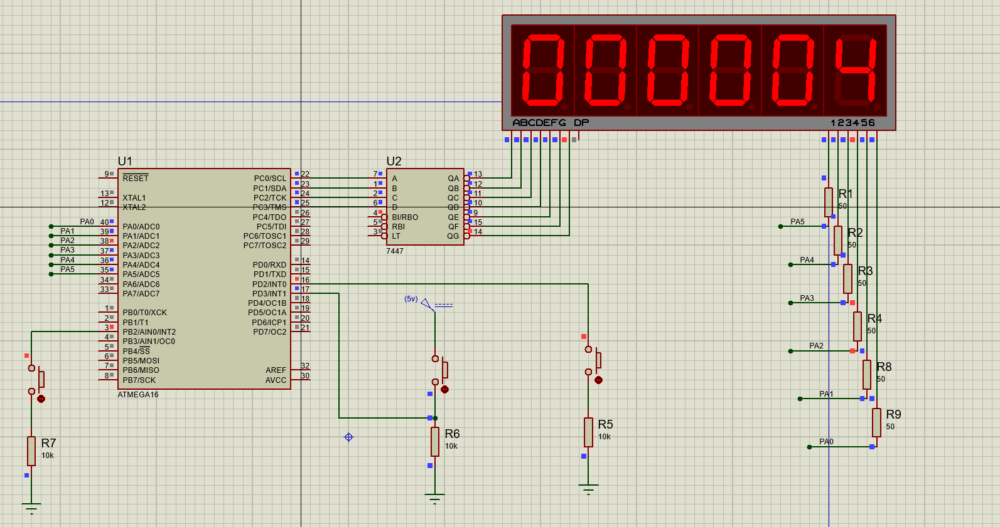

# STOPWATCH USING 6 DIGITS MULTIPLEXED 7 SEGMENTS
## Required :
F_CPU = 1 MHZ.
Use Timer1 CTC Mode to count the time for the stop watch.
1. INT0 (Falling edge using the internal pull up) resets the stop watch.

2. INT1 (raising edge using the external pull down) pauses the stop watch.

3. INT2 (Falling edge using the internal pull up) resumes the stop watch.
  Use The common anode decoder 7447.

## Circuit schematic

It is all about disable all digits by disabling its 5v, Then enable only one digit at a time to display only one number at a time, Then switch between digits by disabling the current digit and enable the next digit, 5ms is fast enough to make human eyes sees them all working at the same time.
